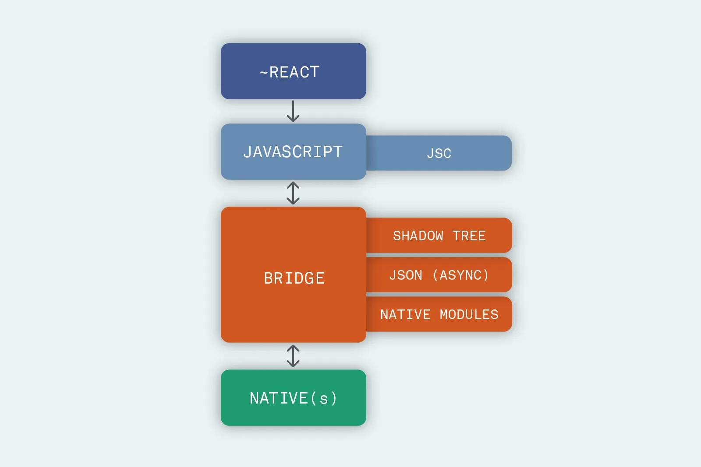

# Phần một: React và Codegen

*Được công bố lần đầu tiên vào năm 2018, kiến ​​trúc lại React Native là một nỗ lực lớn mà Facebook đã thực hiện để giải quyết một số vấn đề lâu dài của giải pháp di động đa nền tảng này.*

*Trong loạt bài này, chúng tôi sẽ giới thiệu tổng quan về các yếu tố chính tạo nên cấu trúc mới của React Native. Chúng tôi sẽ tránh hiển thị code, để giữ cho phần giải thích này dễ tiếp cận nhất có thể và sẽ chia sẻ sự phấn khích của chúng tôi về việc triển khai mới này.*

Trong bài đăng đầu tiên này, chúng tôi thảo luận về khía cạnh của kiến ​​trúc lại sẽ thực sự ảnh hưởng đến code bạn có thể viết — các tính năng React mới và một công cụ có tên là Codegen.

Trước khi đi sâu vào, hãy xem lại những điều cơ bản: React Native là một giải pháp đa nền tảng mã nguồn mở dễ dàng cho phép bạn sử dụng React (và JavaScript) để tạo các ứng dụng di động hoàn toàn gốc. Nó được sử dụng rộng rãi, không chỉ bởi Facebook (công ty phát triển nó với sự giúp đỡ của cộng đồng nhà phát triển xung quanh), mà còn bởi cả các công ty doanh nghiệp như Amazon và Microsoft, cũng như các công ty khởi nghiệp.

Để giúp hình dung cách hoạt động của React Native, chúng tôi đã chuẩn bị đồ thị cơ bản sau:

Như bạn có thể thấy, có bốn phần cốt lõi: code React bạn viết (rất giống với phần tử web của nó), JavaScript được diễn giải từ những gì bạn viết, một loạt các phần tử được gọi chung là "Cầu nối (Bridge)", và phía native.

Khía cạnh quan trọng của kiến ​​trúc hiện tại là hai lĩnh vực, JavaScript và Native, không thực sự “biết” về nhau. Điều này có nghĩa là, để giao tiếp, chúng dựa vào các thông điệp JSON không đồng bộ được truyền qua The Bridge. Chúng được gửi đến mã gốc với kỳ vọng (nhưng không phải là sự đảm bảo) rằng chúng sẽ gợi ra phản hồi vào một thời điểm nào đó trong tương lai.

Mặc dù một cách tiếp cận trực quan để bắt đầu và một cách tiếp cận đã phục vụ tốt React Native trong nhiều năm, nhóm tại Facebook muốn xem xét lại cách tiếp cận thông báo không đồng bộ này để khắc phục hạn chế của nó: để kích hoạt điều này, họ đang làm việc trên một kiến ​​trúc mới cho React Native. Chúng ta có thể mô tả chiến lược của họ như: lấy từng phần trong số bốn phần cốt lõi của React Native và cải thiện chúng một cách riêng lẻ. Trong bài viết này, chúng tôi sẽ giải thích cách nhóm tiếp cận cải thiện khối đầu tiên, **React** . 

Nhóm React Native chủ yếu tận dụng công việc được thực hiện bởi các đồng nghiệp của họ trên thư viện React cốt lõi. Điều này có nghĩa là React Native mới sẽ có thể dựa trên tất cả các tính năng mới được công bố vào năm ngoái tại ReactConf 2018 (bạn có thể tìm thấy bản tóm tắt toàn diện tại đây ). Đặc biệt, Andrew Clark đã giới thiệu các khái niệm về chế độ đồng thời và lệnh gọi lại sự kiện đồng bộ — có sẵn từ React 16.6 — như chúng ta sẽ thấy trong bài đăng thứ ba, cho phép triển khai một số cấp thấp quan trọng.

Tính năng tương đương của React mới, trong tương lai gần, là thay đổi duy nhất của kiến ​​trúc lại sẽ ảnh hưởng đến mã mà hầu hết các nhà phát triển React Native viết — bằng cách sử dụng Suspense để cho các thành phần “đợi” một cái gì đó trước khi hiển thị và Hooks để sử dụng trạng thái và các tính năng React khác mà không cần viết một lớp.

Nhóm React Native cũng đang tăng gấp đôi sự hiện diện của trình kiểm tra kiểu tĩnh (Flow hoặc TypeScript) trong mã. Đặc biệt, họ đang làm việc trên một công cụ có tên là CodeGen để "tự động hóa" khả năng tương thích giữa JS và phía bản địa. Bằng cách sử dụng JavaScript đã nhập làm nguồn chân lý, trình tạo này có thể xác định các tệp giao diện cần thiết cho Fabric và TurboModules (các phần tử của kiến ​​trúc mới sẽ được giới thiệu trong bài đăng thứ ba) để gửi thông điệp qua các lĩnh vực một cách tự tin. Tính năng tự động hóa này cũng sẽ tăng tốc độ truyền thông, vì không cần thiết phải xác thực dữ liệu mọi lúc.

Tóm lại, nếu chúng ta thay thế khối kiến ​​trúc đầu tiên này bằng khối kiến ​​trúc mới của nó, sự thay đổi sẽ như thế này:

Điều này kết thúc phần đầu tiên của cuộc khám phá kiến ​​trúc lại của chúng tôi. Trong vài tuần tới, chúng tôi sẽ phát hành nhiều bài đăng hơn đi sâu vào các yếu tố khác. Trong thời gian chờ đợi, hãy nhớ chia sẻ bài viết này với các nhà phát triển đồng nghiệp của bạn hoặc liên hệ với các câu hỏi tiếp theo trên Twitter (DM đang mở).

Như bạn có thể tưởng tượng, những thay đổi này mở ra cánh cửa cho nhiều cải tiến hơn trong các khối khác và chúng tôi hy vọng chúng khơi dậy sự phấn khích về cách những thay đổi mạnh mẽ này sẽ tác động đến cơ sở mã của bạn mà không yêu cầu bạn phải viết lại (về cơ bản) bất kỳ thứ gì.

