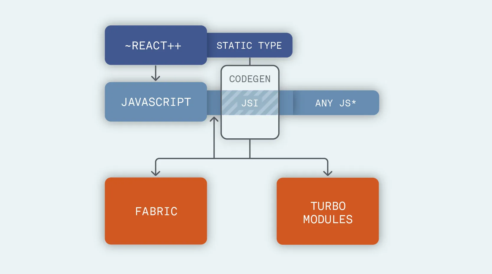

*Được công bố lần đầu tiên vào năm 2018, kiến ​​trúc lại React Native là một nỗ lực lớn mà Facebook đã thực hiện để giải quyết một số vấn đề lâu dài của giải pháp di động đa nền tảng này.*

*Trong loạt bài này, chúng tôi sẽ giới thiệu tổng quan về các yếu tố chính tạo nên cấu trúc mới của React Native. Chúng tôi sẽ tránh hiển thị mã, để giữ cho phần giải thích này dễ tiếp cận nhất có thể và sẽ chia sẻ sự phấn khích của chúng tôi về việc triển khai mới này.*

Trong bài cuối cùng này, chúng tôi giải quyết khối cuối cùng của đồ thị kiến ​​trúc cũ được trình bày trong bài viết đầu tiên :

Phần này thực sự không được lặp lại trực tiếp trên code-khôn ngoan - hầu hết các thay đổi đến từ cách các phần tử trước đó đã được làm lại:

- React & CodeGen 
- JavaScript interface (và JSC)
- Fabric & TurboModules

React Native, ở cấp độ khái niệm hơn, muốn trở thành "bất khả tri" đối với nền tảng gốc của nó. Đây là tính năng chính cho phép tạo các triển khai của bên thứ ba như react-native-web và react-native-windows , trong số các ứng dụng khác.

Hơn nữa, nhóm Facebook không sở hữu nền tảng iOS hoặc Android, vì vậy cách tiếp cận trên khối cuối cùng đó không thể “dọc” đi sâu vào cách chúng hoạt động; nhưng nó có thể là "chiều ngang" trong việc giảm kích thước tổng thể của cơ sở mã gốc phản ứng có liên quan.

Nỗ lực này được gọi là “Lean Core” và đó là khía cạnh của kiến ​​trúc lại nơi mà sự giúp đỡ của cộng đồng là cơ bản. Ở cấp độ cao, điều mà cách tiếp cận này muốn đạt được là lấy mã hiện tại đang sống trong cơ sở mã chính của React Native và trích xuất nó vào kho lưu trữ của riêng nó.

Điều này có hai lợi ích chính: giảm trọng lượng của ứng dụng đã tạo và cho phép bảo trì thích hợp những phần tử không được Facebook sử dụng trực tiếp. Trước đây, phần mềm thứ hai ít được quan tâm hơn do sự phức tạp của việc sửa đổi mã do Facebook sở hữu.

Vì vậy, nếu chúng ta thay thế khối thứ tư này và, khi làm như vậy, tạo toàn bộ đồ họa của kiến ​​trúc React Native mới, thì đây là kết quả:

Như bạn có thể thấy, nỗ lực phức tạp của nhóm Facebook ảnh hưởng đến nhiều khía cạnh khác nhau về cách hoạt động của React Native, mà không ảnh hưởng đáng kể đến các nhà phát triển sử dụng nó. Không phải là một kỳ công nhỏ!

Lợi ích của cấu trúc mới sẽ nâng cao rất nhiều ứng dụng được phát triển qua React Native và sự khác biệt về chất lượng và hiệu suất của chúng so với “ứng dụng gốc thuần túy” sẽ ngày càng nhỏ hơn.

Khi nào những thay đổi này sẽ sẵn sàng và có sẵn? Có khả năng tác phẩm đồ sộ này sẽ hoàn thành vào khoảng quý 4 năm 2019 hoặc quý 1 năm 2020, nhưng vẫn chưa có ngày xác nhận. Do nhóm Facebook đang phát triển kiến ​​trúc mở lại này, bạn có thể theo dõi các bản cập nhật tại bất kỳ thời điểm nào. Tại thời điểm viết bài, chúng tôi có thể tóm tắt nó như sau:

- React = 16.8 mới được hỗ trợ từ phiên bản 0.59 (nitpick: Suspense có sẵn một phần kể từ 16.6)
- CodeGen = tiến trình phát triển trong kho lưu trữ chính ( thảo luận chuyên dụng )
- JSI = đã có trên bản chính và có thể sử dụng được từ phiên bản 0.59 (nhưng không có tài liệu trực tiếp về cách thực hiện, tại thời điểm này) ( thảo luận riêng )
- TurboModules = tiến trình phát triển trong kho lưu trữ chính ( thảo luận chuyên dụng )
- Fabric = quá trình phát triển trong kho lưu trữ chính ( thảo luận chuyên dụng )
- Lean Core = liên tục liên tục, bạn có thể tham khảo vấn đề này để biết thêm chi tiết ( thảo luận riêng )

Đối với hầu hết các điểm ở trên, tôi đã bao gồm một liên kết đến một cuộc trò chuyện dành riêng trên GitHub với thông tin cập nhật nhất, vì vậy hãy theo dõi những thông tin mới nhất!

Tóm lại, chúng tôi nghĩ rằng nỗ lực này cho thấy một số cải tiến tuyệt vời đối với React Native. Đây là thời điểm thú vị để trở thành một nhà phát triển React Native và chúng tôi hy vọng rằng loạt bài viết này đã giúp bạn hiểu rõ hơn về những thay đổi lớn đang diễn ra này.

Nếu đúng như vậy, hãy nhớ chia sẻ bài viết này với các nhà phát triển đồng nghiệp của bạn hoặc liên hệ với các câu hỏi tiếp theo trên Twitter (DM đang mở).

Như bạn có thể tưởng tượng, chúng tôi hy vọng loạt blog này khơi dậy sự phấn khích về mức độ mạnh mẽ của những thay đổi này và cách chúng sẽ tác động đến cơ sở mã của bạn mà không yêu cầu bất kỳ đoạn viết lại nào.